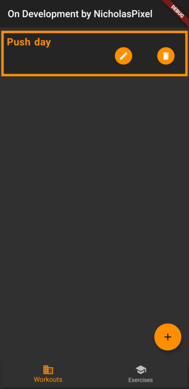

# WorkoutLoggerApp

## An application built with the flutter framework to track your workout made by KuhakuPixel

### How to use:
- 1.Add the exercise that you want to do inside the exercise page and press the add button.

- 2.After pressing the add button in the bottom right corner you should see a modal bottom page like this,fill all the field for the exercise that you want to add	
    Like its name,target muscles,ect and press the add button. 

- 3.Add a workout in the workout page by pressing the add button.

- 4.Press the "add exercise" button to add an exercise to your workout.

-5.Search the exercise that you want to add by filling the exercise name in the search bar

-6.Press the "plus button" Once you find the exercise that you want to add to the workout.

-7.You can add or remove set from all of the exercises in the workout 

-8.Once you have included all of the exercises for your workout press the add button

-9.Now you can press the "pencil button" to view and edit  the repetition,time,weight according to your workout progress

## Apk download

https://drive.google.com/file/d/1FnU8Zj5jLEMYIMS_gAqG7cxQWxL5GtT6/view?usp=sharing

